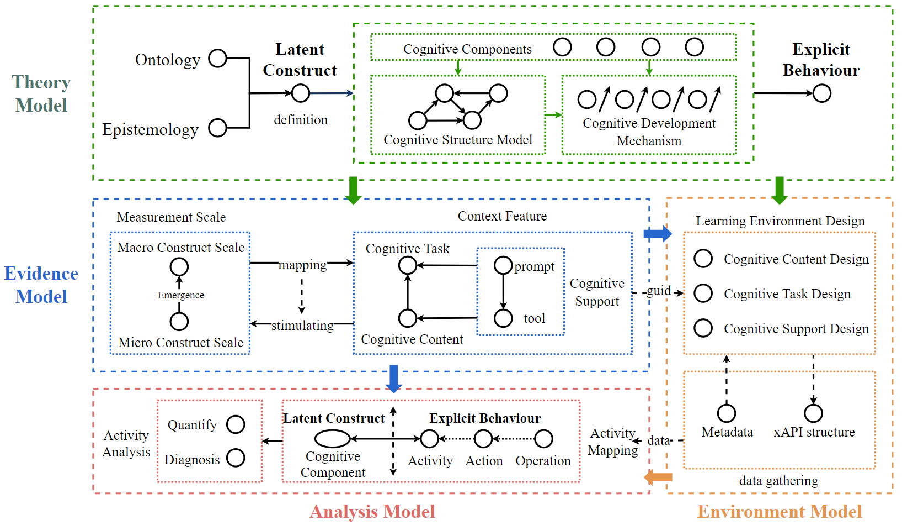

# Metacognition Diagnosis System

## 1. Background

In order to dynamically track and diagnose learners' metacognitive activities more in a holistic way, a "design-driven learning analysis framework" is constructed in this study, as shown below.



DELA establishes the relationship between learning sciences theory and learning analysis practice based on “four designs” including the theoretical model design, evidence model design, environmental model design, and analysis model design which make sure the learning analysis research could ground in learning science theory. Based on DELA, this study developed a metacognitive diagnosis system.


## 2. System Introduction

**how to run the system after cloning**

- make sure you have download **Node.js**
- using code editor such as VS code to open the project
- run the code shown below or open the terminal under this project's fold

```
npm install
npm start
```

### 2.1 System Framework/System UI


### 2.2 Learning Task


### 2.3 Learning Resources


### 2.4 Learning Tools


